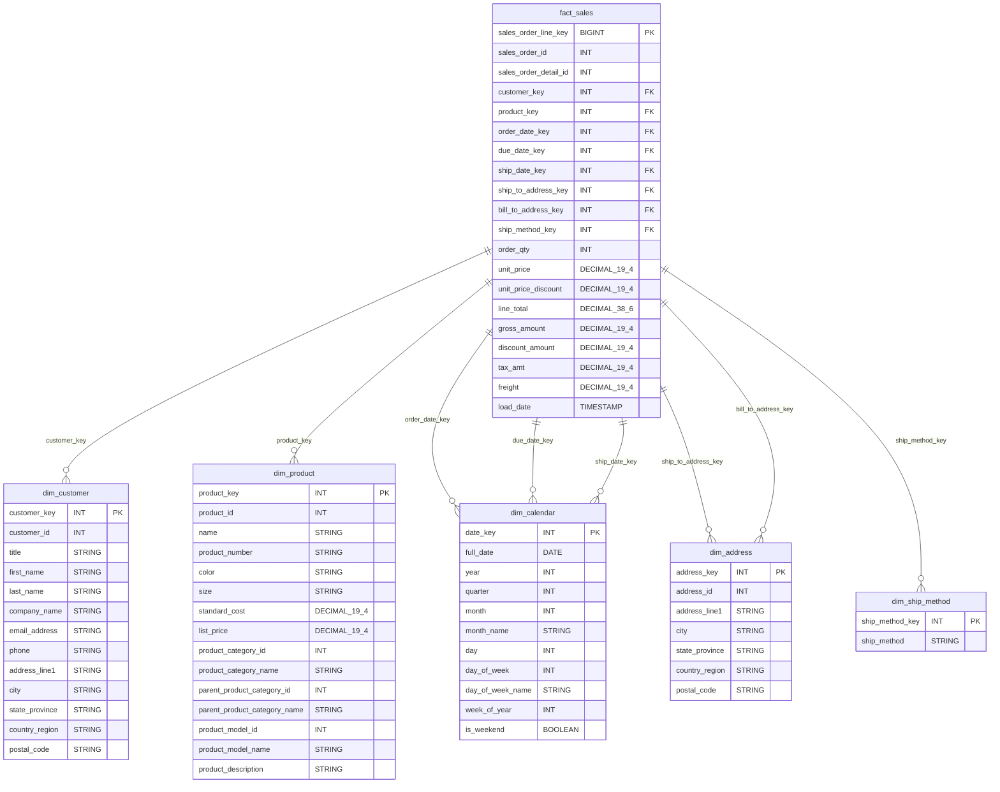

```mermaid
erDiagram
    dim_customer {
      customer_key INT PK
      customer_id INT
      title STRING
      first_name STRING
      last_name STRING
      company_name STRING
      email_address STRING
      phone STRING
      address_line1 STRING
      city STRING
      state_province STRING
      country_region STRING
      postal_code STRING
    }

    dim_address {
      address_key INT PK
      address_id INT
      address_line1 STRING
      city STRING
      state_province STRING
      country_region STRING
      postal_code STRING
    }

    dim_product {
      product_key INT PK
      product_id INT
      name STRING
      product_number STRING
      color STRING
      size STRING
      standard_cost DECIMAL_19_4
      list_price DECIMAL_19_4
      product_category_id INT
      product_category_name STRING
      parent_product_category_id INT
      parent_product_category_name STRING
      product_model_id INT
      product_model_name STRING
      product_description STRING
    }

    dim_calendar {
      date_key INT PK
      full_date DATE
      year INT
      quarter INT
      month INT
      month_name STRING
      day INT
      day_of_week INT
      day_of_week_name STRING
      week_of_year INT
      is_weekend BOOLEAN
    }

    dim_ship_method {
      ship_method_key INT PK
      ship_method STRING
    }

    fact_sales {
      sales_order_line_key BIGINT PK
      sales_order_id INT
      sales_order_detail_id INT
      customer_key INT FK
      product_key INT FK
      order_date_key INT FK
      due_date_key INT FK
      ship_date_key INT FK
      ship_to_address_key INT FK
      bill_to_address_key INT FK
      ship_method_key INT FK
      order_qty INT
      unit_price DECIMAL_19_4
      unit_price_discount DECIMAL_19_4
      line_total DECIMAL_38_6
      gross_amount DECIMAL_19_4
      discount_amount DECIMAL_19_4
      tax_amt DECIMAL_19_4
      freight DECIMAL_19_4
      load_date TIMESTAMP
    }

    fact_sales ||--o{ dim_customer    : customer_key
    fact_sales ||--o{ dim_product     : product_key
    fact_sales ||--o{ dim_calendar    : order_date_key
    fact_sales ||--o{ dim_calendar    : due_date_key
    fact_sales ||--o{ dim_calendar    : ship_date_key
    fact_sales ||--o{ dim_address     : ship_to_address_key
    fact_sales ||--o{ dim_address     : bill_to_address_key
    fact_sales ||--o{ dim_ship_method : ship_method_key
```